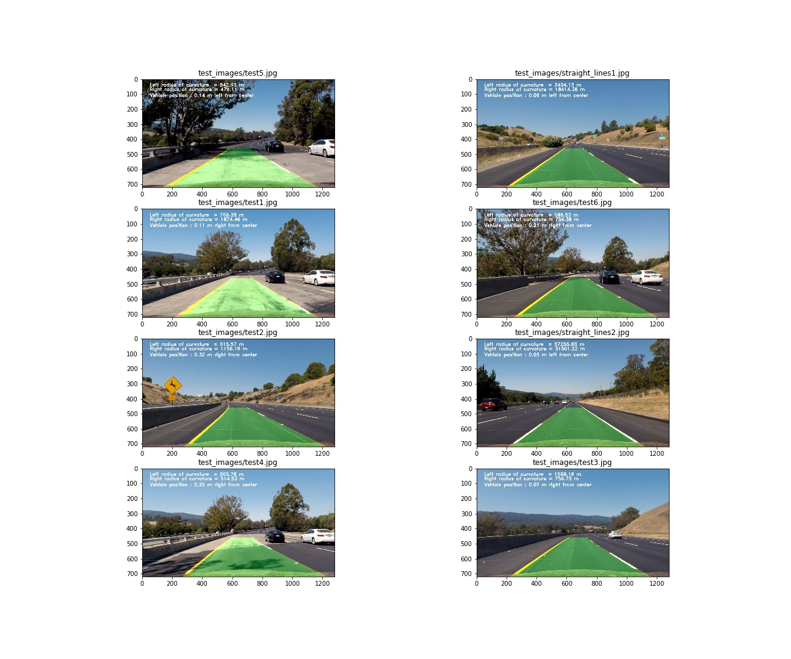

## Project: Advanced Lane Finding Project
[](http://www.udacity.com/drive)

Overview
---


In this project, I used Computer Vision and Open-CV image analysis techniques to detect lane lines on 3 video streams. The goals / steps of this project are the following:

* Compute the camera calibration matrix and distortion coefficients given a set of chessboard images.
* Apply a distortion correction to raw images.
* Use color transforms, gradients, etc., to create a thresholded binary image.
* Apply a perspective transform to rectify binary image ("birds-eye view").
* Detect lane pixels and fit to find the lane boundary.
* Determine the curvature of the lane and vehicle position with respect to center.
* Warp the detected lane boundaries back onto the original image.
* Output visual display of the lane boundaries and numerical estimation of lane curvature and vehicle position.


Rubric Points
---
Here I will consider the [rubric points](https://review.udacity.com/#!/rubrics/571/view) individually and describe how I addressed each point in my implementation.  

### Camera Calibration

The code for this step is contained in the first code cell of the IPython notebook located in "./P4_Advanced_Lane_Lines.ipynb"

I start by preparing "object points", which will be the (x, y, z) coordinates of the chessboard corners in the world. Here I am assuming the chessboard is fixed on the (x, y) plane at z=0, such that the object points are the same for each calibration image.  Thus, `objp` is just a replicated array of coordinates, and `objpoints` will be appended with a copy of it every time I successfully detect all chessboard corners in a test image.  `imgpoints` will be appended with the (x, y) pixel position of each of the corners in the image plane with each successful chessboard detection.  

I then used the output `objpoints` and `imgpoints` to compute the camera calibration and distortion coefficients using the `cv2.calibrateCamera()` function.  I applied this distortion correction to the test image using the `cv2.undistort()` function and obtained these results: 


### Pipeline (single images)

#### 1. Distortion Correction

The first step in my pipeline was to use the `cv2.cv2.undistort` function to remove distortions on my test images, for this calculations, I used the camera matrix and distortion matrix from the camera calibration step.

To demonstrate this step, I will describe how I apply the distortion correction to one of the test images and one of the calibration images:


#### 2. creating a thresholded binary image using Color transforms, gradients and other methods

I first wrote functions to perform different threshold operations on a given image. I experimented with threshold values , kernel size and other hyperparameters and visualized effects of each threshold operator. As shown in the image, threshold binary of 's' channel and 'r' channels seem to give considerably good results.


Here is another picture showing the effects using sobel operator:


I, then used a combination of 's', 'r' and 'v' binary threshold channel and gradient thresholds (absolute sobel(gradient) in x direction) to generate a binary image.  Here's an example of my output for this step.


#### 3. Perspective transform

The code for my perspective transform includes a function called `corners_unwarp()`, which appears in the 10th code cell of the IPython notebook.  The `corners_unwarp()` function takes as inputs an image (`img`), calls the function defined above to undistort this image and then uses `src` and `dest` coordinates to spit out matrces responsible for creating percepective transformed images. I chose the hardcode the source and destination points in the following manner:

```python
src = np.float32([[585, 460],
    [210, img_size[1]],
    [1130, img_size[1]],
    [700, 450]])
dst = np.float32(
    [[(img_size[0] / 4), 0],
    [(img_size[0] / 4), img_size[1]],
    [(img_size[0] * 3 / 4), img_size[1]],
    [(img_size[0] * 3 / 4), 0]])
```

This resulted in the following source and destination points:

| Source        | Destination   | 
|:-------------:|:-------------:| 
| 585, 460      | 320, 0        | 
| 210, 720      | 320, 720      |
| 1130, 720     | 960, 720      |
| 700, 460      | 960, 0        |

I verified that my perspective transform was working as expected by drawing the `src` and `dst` points onto a test image and its warped counterpart to verify that the lines appear parallel in the warped image.


#### 4. Fitting polynomial, detecting lane lines

Followed by obtaining a binary warped image, I used sliding window search for detecting and tracing my lane lines. Here is how it works: 

* First, I obtained the peaks in my image (representing highest brightness) using a histogram function.
* Next, I found the peak of the left and right halves of the histogram. These were my starting point for the left and right lines
* I then chose a window size, and looped through number of windows and collected all the non-zero points in my binary warped image that lied inside each window.
* Next, I fitted a polynomial from the obtained points. Here is an image showing how it looked:


#### 5. Calculating the radius of curvature of the lane and the position of the vehicle with respect to center.

I transferred pixels to meters by multiplying my x and y parameters with meters-per-pixel number and used the [standard formula](http://mathworld.wolfram.com/RadiusofCurvature.html1) to calculate Radius of Curvature from a fitted polynomial, and to calulcate the vehicle offset, I calculated the offset of the lane center from the center of the image (converted from pixels to meters)

#### 6. Final Image warped back

I implemented this step in code cell 16 of my iPython notebook. Here I warped back the polynomial graph I obtained in the previous image on the original image. The final image is shown below:


---

### Pipeline (video)

Video is a collection of images, and therefore most of my image pipeline was easily available for obtaining the lane lines on the video. I did, however, make one thing different - I didn't use the sliding window method again. After frame 1 of the video, I knew where the lines are! In the next frame of video, I didn't need to do a blind search again, but instead just search in a margin around the previous line position. 

Here's a [link to my video result](./test_videos_output/ProjectVideoOutput.mp4)

---

### Discussion

#### Problems / issues I faced in my implementation of this project.  Where will my pipeline likely fail?  What could I do to make it more robust?

My pipeline performs very robust when the light intensities are similar. As soon as there is a bright sunlight, my algorithm doesnt't seem perfect. I feel that sobel operator wasn't a very good threshold operator, however if I used only r and s binary, my lanes would not even get detected in some cases. So I struggled with getting good results where turns are very steep or if there was sudden variation in light intensity.
